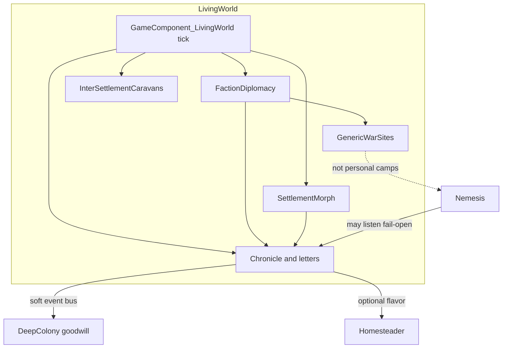
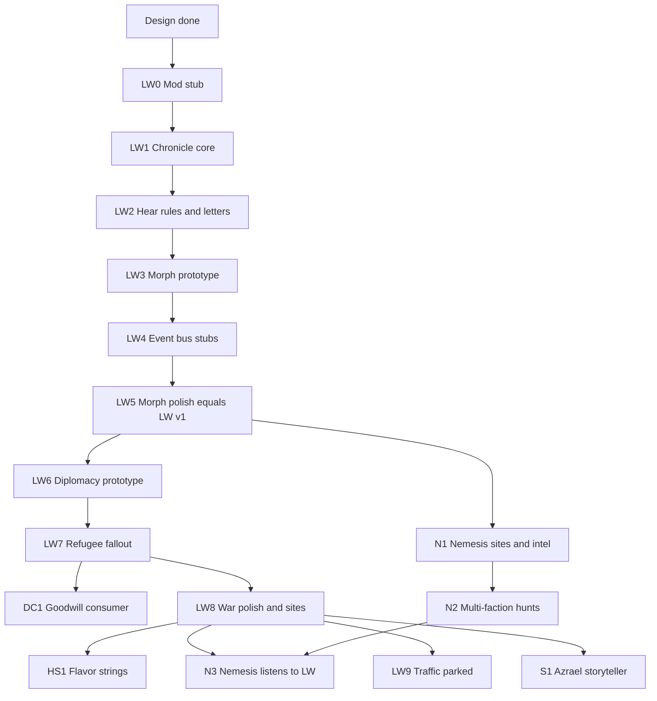

# Living World (parked idea)

**Status:** Phase 1 shipped in-repo (`LivingWorld/` package) — chronicle + settlement morph. Wars / refugees = Phase 2.  
**Package:** `LivingWorld` / `azraelgodking.livingworld`.  
**Series:** Azrael — see [ROADMAP.md](../../ROADMAP.md).

Vanilla RimWorld’s other factions barely change between raids. Settlements are static pins; the world only moves when an incident targets *you*. Living World is the off-map layer that makes factions feel inhabited without stealing systems that belong in Nemesis, Deep Colony, Homesteader, or the rest of the series.

---

## 1. Pitch

The rim keeps happening when you are not looking.

- Distant settlements thrive, starve, found outposts, or burn.
- Factions feud, ally, and collapse into refugee trails.
- You hear about it through rumor, radio, and neighbors — not a second storyteller dumping threat points.

**Player fantasy:** “This planet has politics and history. My colony is one actor in it.”

---

## 2. Non-goals

Living World will **not**:

- Simulate full NPC colonies building rooms / research trees on the world map.
- Run real-time tactical battles between AI settlements beyond abstract resolve rolls.
- Replace or rebalance the storyteller.
- Own a **named personal antagonist** (Nemesis).
- Own **player↔faction goodwill memory / drift** (Deep Colony).
- Own **homestead farmstand / harvest festival / specialty supplier flavor** (Homesteader).
- Own weather disasters (Stormproof), multi-level columns (Strata), or romance scheduling (Date Night).

If a feature is “about your named foe,” “about your goodwill sheet,” or “about your farm brand,” it does **not** go here.

---

## 3. Ownership matrix (hard rule)

| Feature idea | Owner | Why |
|---|---|---|
| Named recurring antagonist, hunt arc, vengeance army inject | **Nemesis** | Personal story, already shipped core |
| Nemesis camp / false-lead quest / taunt caches / route ambushes | **Nemesis** | Tied to an active hunt pawn |
| One nemesis per hostile faction (capped) | **Nemesis** | Still personal antagonists, not world politics |
| Player goodwill from raids / trade / gifts / shared kills; ally decay tuning | **Deep Colony** | Already shipped “living reputation” |
| Goodwill *reaction* to off-map wars you hear about | **Deep Colony** (consumer) | LW emits; DC applies numbers |
| Farmstand, harvest festival, homestead supplier caravan flavor | **Homesteader** | Player-colony agrarian fantasy |
| Homestead letter flavor when LW famine hits outlanders | **Homesteader** (optional consumer) | Flavor only |
| Ion storms, droughts, bottled lightning | **Stormproof** | Weather / hazard |
| Stairs, pockets, cross-level raids | **Strata** | Column fantasy; soft-compat only |
| Lovin schedule / bed seek | **Date Night** | Colony social QoL |
| Off-map chronicle / letters about other factions | **Living World** | Nothing else owns world news |
| Settlement prosperity, rename, abandon, outpost, ownership flip | **Living World** | Settlement agency |
| Faction↔faction tension / war / alliance state | **Living World** | Politics between NPCs |
| Refugee / pass-through warband / trade blackout from those wars | **Living World** | Fallout of NPC politics |
| Generic battlefield / refugee-camp world objects after wars | **Living World** | Not personal nemesis sites |
| Inter-settlement NPC caravans (non-player destination) | **Living World** | Traffic that isn’t “visit player” |
| Azrael storyteller weighting LW + sibling incidents | **Series** ([ROADMAP.md](../../ROADMAP.md)) | Meta, not a system owner |

**Emit / consume:** Living World **emits** structured world events. Sibling mods **consume** via fail-open soft hooks. Living World never reimplements goodwill math or nemesis hunt state.

---

## 4. Why the rim feels inhabited

Players should notice, without reading a wiki:

1. **News** — occasional letters that name factions and places they already know.
2. **Map change** — a settlement vanishes, flips color, or sprouts a camp.
3. **Traffic** — caravans moving settlement→settlement (later); refugees at *your* gate after a war you heard about.
4. **Personal continuity elsewhere** — Nemesis still hunts *you*; Deep Colony still remembers *your* favors; Homesteader still sells *your* jam. Living World is the stage those actors stand on.

---

## 5. Architecture

### Core loop

1. Slow world tick (target: **1–2 resolutions per in-game day**, or every **5–15k ticks**, Mod Options).
2. Pick a small budget of candidates (faction pairs and/or settlements).
3. Roll a micro-event; mutate saved world state.
4. Append `WorldEvent` to a ring-buffer chronicle.
5. Decide whether the **player hears** it; if yes, letter / message.
6. Notify soft consumers (Deep Colony, Nemesis, Homesteader) with plain data — no hard dependency.

### Player hear rules (anti-spam)

A event is visible only if at least one gate passes (stackable, Mod Options verbosity):

| Gate | Intent |
|---|---|
| Prior contact | Non-zero history / goodwill interaction with a involved faction |
| Proximity | Settlement or battle tile within N world cells of player tile |
| Comms | Orbital trade beacon / comms console powered (mid+ tech) |
| Ally | Allied or close friendly faction involved |
| Always major | Severity ≥ threshold (faction destroyed, capital flip) regardless |

Default verbosity: **Medium** (proximity + contact + major). Low = major only. High = most chronicle rows.

### Proposed types (design names)

- `GameComponent_LivingWorld` — tick, options cache, chronicle, diplomacy table, morph cooldowns.
- `WorldEvent` — tick, kind, severity, faction IDs, settlement / tile IDs, flags, `seenByPlayer`.
- `FactionPairState` — tone (`Peace` / `Tension` / `War` / `Alliance`), intensity, lastResolveTick.
- `SettlementMood` — prosperity −2…+2, lastMorphTick, epithet key (optional).
- Soft bus: static `LivingWorldSignals.OnEvent` (or Harmony-free reflection entry) that siblings register into when present.

Workers never call Verse from ThreadPool for this sim — world tick stays main-thread and cheap (abstract rolls only).

---

## 6. Systems

### 6.1 Chronicle (Living World)

**Purpose:** Durable off-map history the player can glimpse.

**v1**

- Ring buffer (e.g. last 64–128 events) scribed in the game component.
- LetterDefs / keyed strings per `WorldEventKind`: skirmish, decisive victory, famine rumor, founding, collapse, alliance, betrayal, ownership flip, refugee flight.
- Dev: dump chronicle; force event.

**Later**

- In-game History / World tab browser.
- Rare storyteller `IncidentWorker` for “breaking news” that is still severity-gated (not threat points).

**Not chronicle:** Nemesis taunt letters, Homesteader Kats Effect, Stormproof weather letters — those stay in their mods. Chronicle may *mention* a storm-hit region only via soft Stormproof query if both loaded (parked).

---

### 6.2 Settlement morph (Living World)

Vanilla `Settlement` world objects are mostly static. Morph mutates presentation and membership.

| Mutation | Player-visible effect | Notes |
|---|---|---|
| Prosperity drift | Inspector / label cue: thriving / stable / struggling | Optional later: slight trader stock bias |
| Epithet / rename | Rare flavor name after victory or disaster | Never rename player faction bases |
| Shrink / abandon | Remove settlement or replace with abandoned/ruin world object | Cap abandons per year |
| Grow / outpost | Spawn secondary settlement or temporary camp for same faction | Cap outposts per faction |
| Ownership flip | `Settlement.Faction` changes after decisive war | Letter if hear-rules pass |

**Guards**

- Never morph the player’s tile / player settlements.
- Max morphs per year (option).
- Prefer factions with ≥2 settlements when abandoning one.
- Cooldown per settlement after any morph.

---

### 6.3 Faction↔faction diplomacy (Living World)

Vanilla goodwill between NPC factions exists but rarely *shows*. Living World adds an explicit **tone** layer the sim drives.

**State:** for each unordered pair of non-player, non-defeated factions with settlements: tone + intensity + last tick.

**Resolve table (sketch)**

| From | Roll | To / effect |
|---|---|---|
| Peace | Border friction | Tension + small chronicle |
| Tension | Skirmish | Intensity++; possible prosperity dip |
| Tension | Cool off | Back toward Peace |
| War | Battle | Loser prosperity−−; winner +; chance morph / site |
| War | White peace | Tension |
| Peace / Alliance | Formal pact | Alliance (rare; Ideology later) |
| Alliance | Betrayal | War + major letter |

Player impact is **indirect** (see fallout incidents). Numeric player goodwill changes are **Deep Colony’s job** when it listens.

---

### 6.4 Fallout incidents (Living World)

Storyteller-friendly, LW-owned, fired when war/morph severity warrants (and optionally registered for Azrael later):

1. **Refugee caravan** — losing faction survivors seek help or pass by.
2. **Pass-through warband** — hostile to their enemy; relations to player carefully tuned (often neutral-hostile temporary). Balance hazard: use points caps and long MTB.
3. **Opportunity** — aid an ally’s war (quest/site) or sell supplies to both (later / Ideology-aware).
4. **Trade blackout** — temporary block or scarcity for a faction at total war.

**Not LW:** Nemesis vengeance raid inject, Homesteader supplier caravan defs.

---

### 6.5 Generic war sites (Living World)

After decisive NPC battles, spawn short-lived or permanent-ish world objects:

- Battlefield debris site (loot / danger).
- Refugee camp (quest or caravan source).
- Contested outpost (temporary; may flip or vanish).

**Must not** clone Nemesis false-lead personal camps. If both mods load, Nemesis sites remain hunt-keyed; LW sites remain war-keyed. Shared tile avoidance: soft check so two special sites do not stack on one cell.

---

### 6.6 Inter-settlement traffic (parked detail, still LW-owned)

NPC caravans whose destination is another settlement (not the player). v1 can ship **without** this; chronicle + morph + diplomacy already sell “alive.”

When built:

- Spawn/despawn on world map with faction colors.
- Chance to divert and visit player if path near (uses vanilla visit patterns lightly).
- Homesteader does **not** own this; it may flavor trader inventory if a divert is Homesteader-compatible outlander (consumer).

---

## 7. Soft-compat contracts

All fail-open: missing mod ⇒ LW no-ops the hook; sibling no-ops if LW missing.

### Deep Colony (consumer)

| LW signal | DC behavior |
|---|---|
| Visible war where player shares an enemy with a winner | Small positive drift toward winner / shared-enemy pattern |
| Ally faction losing badly | Small sympathy drift or mood-agnostic goodwill nudge |
| Ally faction destroyed | Larger one-shot drift / thought opportunity (DC-owned thoughts if any) |

DC keeps `FactionRepUtility` / drift buffer as source of truth for player goodwill.

### Nemesis (peer; personal layer)

| LW signal | Nemesis behavior |
|---|---|
| Nemesis’s faction crushed / fled region | Escalate aggression **or** go dormant (option) |
| Nemesis’s faction wins regionally | Taunt flavor referencing conquest (optional) |
| LW war site on same tile as hunt intel | Prefer Nemesis site ownership; LW skips or offsets tile |

Nemesis does **not** read LW for spawning personal camps — those stay Nemesis roadmap items.

### Homesteader (consumer, flavor)

| LW signal | Homesteader behavior |
|---|---|
| Famine / struggling outlander settlement news | Optional letter line referencing preserves / shortage |
| Refugee incident + Homesteader loaded | Slight chance refugees mention needing seed/stock (string only) |

Farmstand, festival, Diggo supplier remain Homesteader roadmap — **not** ported into LW.

### Stormproof / Strata / Date Night

- Stormproof: optional “storm-scarred region” chronicle flavor if API exists; no weather ownership transfer.
- Strata: none required for v1; raids that reach a multi-level colony stay Strata’s problem.
- Date Night: none.

### Azrael storyteller (series)

When built, weights:

- LW fallout incidents (refugees, warbands) at low threat cost.
- Does not replace LW’s silent sim tick.
- Still weights Nemesis / Homesteader / Stormproof / Strata incidents as in [ROADMAP.md](../../ROADMAP.md).

---

## 8. Slice plans

### Slice 1 — World news + settlement morph (Living World)

**Milestone A — Design** ✓ (this doc)  
**Milestone B — Prototype**

- `GameComponent_LivingWorld` + `WorldEvent` ring buffer.
- Hear-rules + 6–8 letter kinds.
- Prosperity drift + abandon **or** ownership flip (pick one morph for prototype).
- Dev force event / force morph.
- Soft stub method Deep Colony can call later.

**Milestone C — Polish**

- Full morph table with yearly caps.
- Inspector prosperity / epithet.
- History dump UI or debug view.
- Mod Options: verbosity, morph rate, enable/disable morph.

**Acceptance**

- Over one in-game year on a medium world, player sees multiple non-spam letters and at least one map-visible settlement change without LW touching player goodwill math.

---

### Slice 2 — Faction wars / diplomacy (Living World)

**Milestone A — Design** ✓ (this doc)  
**Milestone B — Prototype**

- `FactionPairState` table scribed.
- Tension ↔ war resolves with chronicle rows.
- One fallout incident (refugees).
- DC soft hook on visible war (no-op if DC absent).

**Milestone C — Polish**

- Alliance / betrayal rare path.
- Trade blackout + pass-through warband (strict caps).
- Generic war site spawn.
- Options: war rate, fallout enable, max concurrent wars.

**Acceptance**

- Two NPC factions can enter War without player involvement; settlements show fallout; player may get refugees; goodwill changes only if Deep Colony present and listening.

---

### Slice 3 — Nemesis world sites & multi-faction antagonists (**Nemesis mod**)

Owned entirely by Nemesis. Living World only provides optional listen hooks. Detail also mirrored in [Nemesis/ROADMAP.md](../../Nemesis/ROADMAP.md).

#### 3a. Hunt base / false-lead arc

| Piece | Acceptance sketch |
|---|---|
| Aggression gate | Site/quest only above aggression threshold X |
| World site / quest | “Nemesis camp” offer; resolving may be real fight, empty camp, or trap |
| Intel chain | Scrap drop → last-known tile reveal → site unlock; each step needs hunt active |
| Route ambush | Caravan encounter map tied to nemesis pawn / faction |
| Taunt cache | Abandoned stockpile with note; no LW war-site def reuse |

#### 3b. Multi-faction antagonists

| Piece | Acceptance sketch |
|---|---|
| Cap | At most one active nemesis **per** hostile faction; global cap 1–2 |
| Identity | Same hunt component / letter pipeline; faction-colored strings |
| Not LW | No shared “warlord” table inside Living World |
| LW listen | If LW reports faction destroyed → escalate or end hunt (fail-open) |

#### 3c. Still Nemesis (existing roadmap, unchanged owner)

- Social memory with fixation target; unique apparel tint; comms replies.
- Flee `LordJob`; Odyssey shuttle soft extract.
- Soft compat: Stormproof bait, Strata stairs, Homesteader pantry defNames.
- Preview / Steam / balance passes.

---

## 8b. Completion sequence (logical build order)

Everything below is sorted by **dependency**, not by which roadmap file it lives in. Do not start a step until its prerequisites are done. Parallel tracks are marked.

### Phase 0 — Done

| Step | Owner | Work |
|---|---|---|
| **D0** | Docs | This design + series / Nemesis / DC / Homesteader ownership roadmaps |

### Phase 1 — Living World foundation (ship a thin mod)

| Step | Owner | Work | Depends on | Status |
|---|---|---|---|---|
| **LW0** | Living World | Cut mod package (`LivingWorld` / `azraelgodking.livingworld`): About, csproj, Harmony boot, settings, CI zip | D0 | Done |
| **LW1** | Living World | `GameComponent_LivingWorld` + `WorldEvent` ring buffer + scribe + slow tick skeleton | LW0 | Done |
| **LW2** | Living World | Hear-rules + letter kinds + spam caps + dev dump/force event | LW1 | Done |
| **LW3** | Living World | Morph prototype: prosperity drift + ownership flip | LW2 | Done |
| **LW4** | Living World | `LivingWorldSignals` soft bus | LW2 | Done |
| **LW5** | Living World | Morph polish: abandon, outpost, epithet, inspector/label, Mod Options, force morph debug | LW3, LW4 | Done |

**Checkpoint — Living World v1 playable:** news + morph without diplomacy. Acceptance = §8 Slice 1.

### Phase 2 — Wars and player fallout

| Step | Owner | Work | Depends on |
|---|---|---|---|
| **LW6** | Living World | `FactionPairState` Peace/Tension/War; skirmish/battle rolls write chronicle + nudge prosperity | LW5 |
| **LW7** | Living World | Refugee fallout incident (LW-timed or storyteller-friendly); tie to visible war severity | LW6 |
| **DC1** | Deep Colony | Fail-open register on bus; map visible war / ally disaster → existing `AddFactionDrift` / `FactionRepUtility` | LW4, LW7 |
| **LW8** | Living World | War polish: max concurrent wars, white peace, rare alliance/betrayal, trade blackout, pass-through warband (**default cautious**), generic war sites + tile avoid vs Nemesis | LW7 |

**Checkpoint — Slice 2 acceptance:** NPC wars without player; refugees possible; goodwill only if DC loaded.

### Phase 3 — Sibling consumers and Nemesis personal layer (parallel OK)

These can run in parallel after their deps; they must not invent LW systems.

| Step | Owner | Work | Depends on |
|---|---|---|---|
| **HS1** | Homesteader | Optional famine/refugee flavor keyed lines only (no farmstand in LW) | LW7 or LW8 |
| **N1** | Nemesis | Hunt sites: aggression gate, camp quest real/false lead, intel chain, route ambush, taunt cache | D0 (can start after D0; tile-avoid needs LW8 if both load) |
| **N2** | Nemesis | Multi-faction antagonists: 1 per hostile faction, global cap 1–2 | N1 core hunt stable |
| **N3** | Nemesis | Listen to LW faction crushed/fled → escalate or dormant (fail-open) | N2, LW6+ |
| **N4** | Nemesis | Personal polish track (independent): social memory, tint, comms, flee `LordJob`, Odyssey shuttle, Stormproof/Strata/Homesteader pantry soft-compat, preview/Steam/balance | Playable core already; no LW dep |

### Phase 4 — Post-v1 Living World and series

| Step | Owner | Work | Depends on |
|---|---|---|---|
| **LW9** | Living World | Inter-settlement traffic (NPC caravans settlement→settlement; rare divert to player) | LW8 |
| **LW10** | Living World | Opportunity quests / Ideology aid-or-sell; chronicle History UI; trader stock bias from prosperity (if playtests want it) | LW8 |
| **S1** | Series | Azrael storyteller weights LW fallout + sibling incidents | LW7+, Nemesis/Homesteader/Stormproof/Strata incidents exist |
| **S2** | Series | Showcase “The Deep Homestead” optionally lists LW + DC | S1 / LW v1+ |

### Explicitly out of order / never in Living World

Do **not** schedule these under the Living World package:

- Nemesis vengeance armies, personal camps, multi-hunt caps → **Nemesis** (N1–N4)
- Goodwill drift math / ally decay → **Deep Colony** (shipped + DC1)
- Farmstand, harvest festival, Diggo supplier, aging preserves → **Homesteader** roadmap
- Weather / column / romance → Stormproof / Strata / Date Night

### Suggested execution cadence

1. **Now → next code branch:** Phase 1 (LW0–LW5) only.  
2. **Second code branch:** Phase 2 (LW6–LW8 + DC1).  
3. **Parallel or third:** Phase 3 Nemesis N1–N3 when hunt fantasy is the priority; HS1 is tiny.  
4. **Later:** Phase 4 traffic, Azrael, polish questions in §11.

---

## 9. Living World v1 cut list (when mod is created)

**In**

- Chronicle + letters + hear-rules  
- Settlement morph with caps  
- Faction pair tones + skirmish/war resolve  
- Refugee fallout incident  
- Soft event bus stubs for DC / Nemesis / Homesteader  
- Mod Options + dev tools  

**Out of v1**

- Inter-settlement traffic visualization  
- Opportunity quests / Ideology branches  
- Full war-site loot loop polish  
- Azrael storyteller (series task)  
- Any Nemesis personal site defs  

---

## 10. Balance & spam guards

- Global max letters per quadrum (option).
- Max concurrent `War` pairs (e.g. 1–3).
- Morph yearly budget.
- Fallout incidents use long MTB and storyteller points carefully (prefer LW-timed fires over threat category spam).
- Performance: O(factions²) pair table is fine at vanilla faction counts; skip defeated / insect / mech as needed via faction def filters.
- Saves: all LW state in `GameComponent`; clearing mods mid-save must not brick (tolerant scribe).

---

## 11. Open questions (playtest later — not doc blockers)

1. Should prosperity affect vanilla trader stock generation, or stay cosmetic in v1?
2. Do tribal / pirate / ideoligion factions need separate morph MTBs?
3. Odyssey gravship worlds: disable morph for temporary world objects?
4. Should “pass-through warband” be default-off for Cassandra/Rage difficulty?
5. Chronicle UI vs letters-only for first Workshop release?

---

## 12. Related docs

- [Series ROADMAP](../../ROADMAP.md)  
- [Nemesis ROADMAP](../../Nemesis/ROADMAP.md) — personal antagonists & sites  
- [Homesteader ROADMAP](../../Homesteader/ROADMAP.md) — farmstand / festival (consumer only for LW)  
- [Deep Colony ROADMAP](../../Deep%20Colony/ROADMAP.md) — goodwill consumer only  

### Deep Colony touchpoints (consumer only)

Do **not** add world sim to Deep Colony. When LW ships, DC may:

- Register for `LivingWorldSignals` / equivalent.
- Map visible wars to existing `AddFactionDrift` / `FactionRepUtility` hooks.
- Keep idle ally drift behavior as today.

### Homesteader touchpoints (consumer only)

Do **not** move farmstand, festival, aging preserves, or Diggo supplier into Living World. When LW ships, Homesteader may:

- Add optional keyed flavor lines for famine/refugee news.
- Keep all player-colony agrarian systems on its own roadmap.
